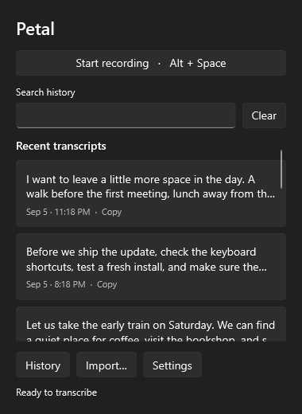

<p align="center">
  
  <h1 align="center">Petal for Windows</h1>
</p>

<p align="center">Fast, local speech to text. A native Windows app with Whisper and Parakeet.</p>

<p align="center">
  <a href="https://github.com/Aayush9029/petal-windows/releases/latest"></a>
  <a href="https://github.com/Aayush9029/petal"></a>
</p>


Record from any app with a shortcut you choose. Press it again to finish, and Petal pastes the text where you were typing. Your audio stays on your computer.

- Whisper Tiny, Small, Large V3 Turbo, and Parakeet V3.
- Searchable history, audio playback, and file transcription.
- A tray palette and a small recording bar.
- Native Windows controls. No browser runtime, account, or API key.

## Get started

[Download the latest release](https://github.com/Aayush9029/petal-windows/releases/latest), extract the ZIP, and open `Petal.exe`. Download a model in **Models**, then press **Alt + Space** to record. Change the shortcut in **General**.

Windows 10 22H2 or Windows 11, x64. Runs on the CPU; no NVIDIA GPU required. Model downloads are separate. This preview is unsigned, so Windows may show a security warning. It is not Microsoft Store approved.

Prefer PowerShell? [Inspect the installer](scripts/install.ps1), then:

```powershell
Invoke-WebRequest https://github.com/Aayush9029/petal-windows/releases/latest/download/install.ps1 -OutFile install.ps1
.\install.ps1
```

It downloads the latest release, checks SHA-256, installs under your user profile, and opens Petal. It does not require admin rights or change Windows security settings.

## A closer look

| Your shortcut | Local models |
| --- | --- |
|  |  |

<p align="center"></p>

Screenshots use fictional demo transcripts. [More screenshots](assets/readme/screenshots).

## Build

Install the [.NET 10 SDK](https://dotnet.microsoft.com/download/dotnet/10.0), then:

```powershell
.\scripts\build.ps1 -Check -Package
```

[Development notes](docs/DEVELOPMENT.md) · [Windows security and sandbox testing](docs/WINDOWS-SECURITY.md) · [Test results](docs/TESTING.md)

Built from [Petal for macOS](https://github.com/Aayush9029/petal) by Aayush. MIT licensed. [Third-party notices](THIRD-PARTY-NOTICES.md).
